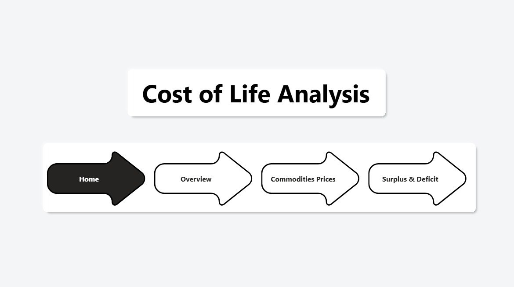
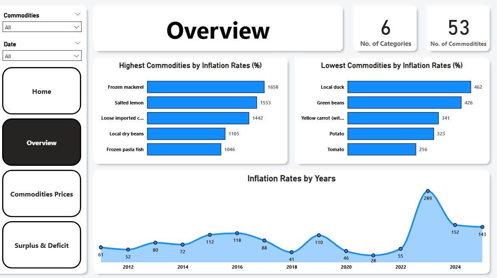
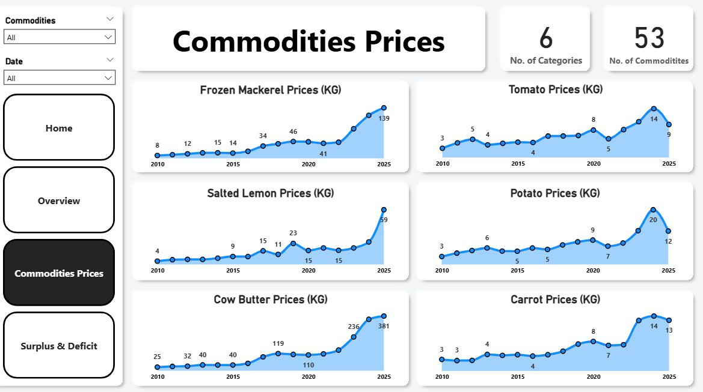
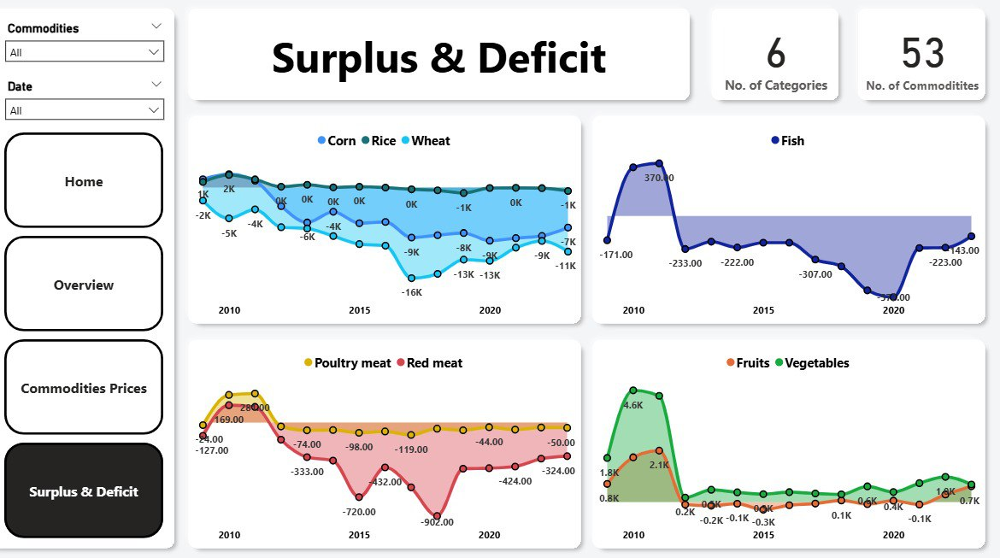

# 📈 Cost of Life Analysis in Egypt (2010–2025)

**A Data Analysis Project on Food Commodity Prices and Supply Security using Power BI**

---

## 📄 Summary

This document provides a comprehensive summary of the data collected and utilized for the **Cost of Life Analysis Project in Egypt**. The project focuses on tracking and analyzing the prices of essential food commodities, alongside their respective surplus and deficit levels, over a substantial period spanning from **2010 up to 2025**. All data was sourced from the official and reliable governmental body, the **Central Agency for Public Mobilization and Statistics (CAPMAS)** in Egypt.

### Project Fundamentals

| Property | Details |
| :--- | :--- |
| **Project Title** | Cost of Life Analysis in Egypt |
| **Data Source** | Central Agency for Public Mobilization and Statistics (CAPMAS) |
| **Analysis Period** | From 2010 up to 2025 |
| **Primary Objective** | To analyze food price trends and the impact of commodity surplus/deficit on the overall cost of living. |

## 📊 Collected Data Structure

The core dataset comprises two main indicators:

### 1. Food Commodity Prices (Price Data)

This set includes detailed records of the average consumer prices, critical for analyzing inflation rates.

* **Covered Commodities:** Birds, Fish, Grains, Dairy Products, Meat, and Vegetables & Fruits.

### 2. Food Commodity Surplus/Deficit (Supply Data)

This data set illustrates the volume of local production versus consumption.

* **Surplus:** Local production meets and exceeds consumption.
* **Deficit:** Local production does not meet consumption, necessitating imports.

---

## ⚙️ Data Cleaning and Preprocessing Steps

The following steps were implemented to prepare the data for analysis:

1.  **Data Translation (Arabic to English):** All textual data (column names, commodity names, etc.) were translated for consistency.
2.  **Data Consolidation (Creating `commodities` Table):** All unique food items were combined into a master reference table.
3.  **Primary Key Creation:** A Primary Key named `commodity_id` was established for data modeling.
4.  **Annual Average Prices Calculation (`avgprices` Table):** Calculated the arithmetic mean of prices for each commodity annually.
5.  **Annual Inflation Rate Calculation (`inflation_stats` Table):** Generated the year-over-year percentage change (inflation rate) for each commodity's average price.
6.  **Reshaping the Surplus/Deficit Table (Unpivot):** Converted the supply table from a wide to a long (tidy) format.

### Technical Implementation

| Component | Detail |
| :--- | :--- |
| **DAX Measures** | `No. of Commodities`, `No. of Categories` |
| **Hierarchy** | `Category` hierarchy (`Category`, `Commodity`) |
| **Data Modeling** | **Star Schema:** Linked the central `Commodities` table to all price and supply tables. |

---

## ❓ Key Analytical Questions & Results

The project answered critical questions about inflation and supply security:

### 1. Inflation Analysis

| Question | Answer Summary | Visualization |
| :--- | :--- | :--- |
| **Highest Inflation Commodities** | Frozen Mackerel, Salted Lemon, Imported Cow Butter, Dry Beans, Frozen Pasta Fish. | Bar Chart |
| **Lowest Inflation Commodities** | Tomato, Potato, Carrot, Green Beans, Local Duck. | Bar Chart |
| **Annual Inflation Trend** | Trend over 2010–2025 (Highlights major spikes in 2016 and 2023). | Area Chart |

### 2. Supply & Demand Analysis

| Commodity Category | Analysis Focus | Location |
| :--- | :--- | :--- |
| **Staple Grains** (Wheat, Rice, Corn) | Comparison of production/consumption gaps. | `Surplus & Deficit` Page |
| **Meat** (Poultry Meat, Red Meat) | Overall protein security. | `Surplus & Deficit` Page |
| **Produce** (Vegetables, Fruits) | Supply status of fresh produce. | `Surplus & Deficit` Page |

---

## 💡 Key Insights

> **"Analysis reveals a dual challenge: high inflation driven by imported goods vs. persistent deficits in strategic staples."**

* **Vegetables are the Least Affected by Inflation:** Fresh produce exhibited the **lowest inflation rates**, suggesting relative stability and strong local production cycles.
* **Differentiated Devaluation Impact:** The price increases following currency devaluation events (2016 and 2023) were not uniform; imported goods saw immediate, sharp spikes.
* **General Food Supply Deficit:** There is a **deficit** in the supply of most essential food commodities (grains, meat, fish), increasing import dependency.
* **Surplus in Produce:** The vegetable and fruit category enjoys a **significant surplus** in local production, a strength in food security.

---

## 🖼️ Dashboard Previews

### 1. Home Page

### 2. Overview Page (Inflation)

### 3. Commodities Prices Page

### 4. Surplus & Deficit Page

